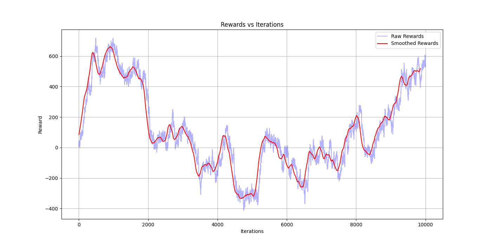
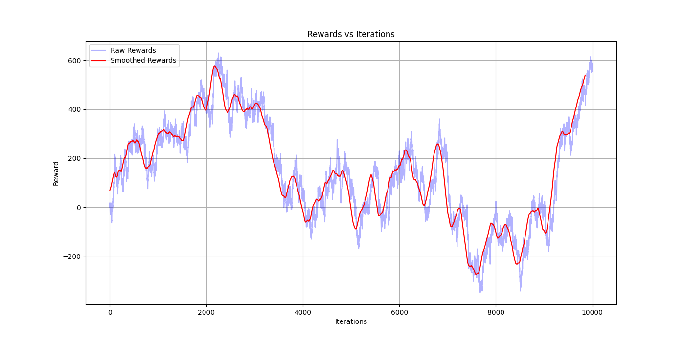
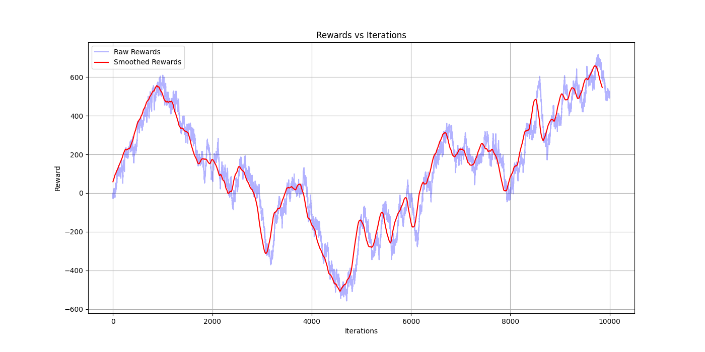

# Traffic Congestion Reduction with SARSA

<h3 align="center">


</h3>

#### CS 695 - Decision Making and Reinforcement Learning (GMU)


#### Installation (Docker)

1. Clone the repository

`git clone https://github.com/praneethravuri/traffic-congestion-reduction-with-SARSA.git`

2. Build Docker Image

`docker build -t sarsa-traffic .`

3.  Configure Environment for Graphical Display

    1. For Linux/WSL Users: `export DISPLAY=$(cat /etc/resolv.conf | grep nameserver | awk '{print $2}'):0`

    2. For Windows Users (WSL): ```export DISPLAY=$(grep nameserver /etc/resolv.conf | cut -d ' ' -f 2):0.0```

4. Running the application

    1. Running main.py: ```docker run -it -e DISPLAY=$DISPLAY -e XDG_RUNTIME_DIR=/tmp sarsa-traffic python main.py```

    2. Running model.py: ```docker run -it -e DISPLAY=$DISPLAY -e XDG_RUNTIME_DIR=/tmp sarsa-traffic python model.py```

### Introduction and Motivation

Urban areas around the globe are increasingly grappling with the challenge of traffic
congestion. This not only leads to longer commute times but also contributes to
environmental pollution and stress. Traditional traffic control systems, like standard
traffic lights, often fail to keep up with the dynamic and unpredictable nature of road
traffic. To address these challenges, our team has been working on a cutting-edge
solution.

### Code Structure Analysis

The project utilizes Python's Pygame library to simulate traffic at a four-way intersection,
detailed across several files like Crossing.py, Intersection.py, Traffic_lights.py,
Vehicle.py, Main.py, Model.py, Sarsa.py, and Train.py. The first four files create the
intersection's visual components, including roads, crossings, traffic lights, and vehicles.
Vehicles are generated for each lane with attributes like position and direction assigned
randomly, and their intended direction after passing signals is indicated by color coding:
orange for straight, blue for left, and pink for right.
Traffic lights operate in cycles, randomly starting with a green light for 10 seconds,
followed by yellow for 2 seconds, then red, mimicking real-world traffic light patterns. In
Vehicle.py, threshold points are set for each lane to indicate where vehicles should stop
for red or yellow lights, and for turning vehicles, these points mark where turns should
be executed. The simulation also factors in realistic gaps between vehicles at red lights,
enhancing the authenticity and management efficiency of the traffic system.

### Reward Calculation for SARSA

In our project, we use two key indicators to assess traffic congestion and calculate
rewards within a SARSA-based traffic management system. The Delay Time Indicator
(DTI) [1] measures the waiting time of vehicles at red lights, summing up these times for
each lane. Alongside, the Vehicle Count [1] tracks the number of vehicles in each lane
when the light is red. Together, these provide a comprehensive view of traffic flow and
congestion.
Rewards for each lane are calculated based on the percentage change in congestion
after SARSA's decision-making. Significant congestion reduction (over 50%) earns a
high reward of 20 points, moderate reduction (25%-49%) gets 10 points, and minor
improvement (0%-24%) receives 5 points. Conversely, increasing congestion results in
penalties: over 50% increase deducts 20 points, 25%-49% increase takes away 10
points, and less than 24% increase reduces the reward by 5 points. This system
encourages strategies to effectively reduce congestion, aiming for efficient traffic
management at intersections.

### SARSA Implementation

The SARSA (State-Action-Reward-State-Action) algorithm in this code is a
reinforcement learning method applied to manage traffic lights at intersections, aiming
to optimize traffic flow and reduce congestion. The algorithm learns a policy by mapping
states of the environment, which are the traffic conditions including vehicle positions
and movements, to appropriate actions. This policy is developed through trial and error,
with the traffic light controller, acting as the agent, receiving rewards or penalties based
on action outcomes.
The state space is defined by a combination of factors including the number of vehicles
that can be generated in a lane, the number of lanes, and the states of traffic lights (red,
yellow, green). This provides a comprehensive representation of various traffic
scenarios. The action space includes four actions, each corresponding to changing the
traffic light in one of the four directions: north, east, south, or west. Key parameters of
SARSA in this implementation are the learning rate (alpha), discount factor (gamma),
and exploration rate (epsilon). The learning rate determines the weight of new
information, the discount factor values future rewards, and the exploration rate balances
between exploring new actions and exploiting known ones.
An epsilon decay mechanism is employed to transition the model from exploration to
exploitation; it starts high to encourage exploration and gradually decreases to allow
more reliance on the learned policy. Specifically, the model explores in the first 90% of
iterations and exploits in the remaining 10%.
The `apply_action` function enacts the chosen action, altering the traffic light state at the
intersection according to current conditions and the learned policy. This interaction
between SARSA and the traffic simulation forms the learning process's core, enabling
continuous adaptation and enhancement of the traffic light control policy.
The `train.py` file trains the model over 50 generations, advancing to the next
generation once 10,000 rewards are accumulated in each. This approach allows the
model to learn from various traffic scenarios. After each generation, the learned Q-table,
which records the value of actions in different states, is saved to `sarsa_q_table.npy`,
and both the simulation and its parameters are reset. This ensures fresh learning in
each generation and prevents bias from earlier experiences. Post-training, `model.py`
uses the best Q-values from `sarsa_q_table.npy` to determine optimal actions in the
simulation. This phase demonstrates the application of learned strategies in real-time
traffic management, utilizing the training phase's accumulated knowledge for effective
traffic light control.

|                  α = 0.05, γ = 0.9                  |                  α = 0.05, γ = 0.95                  |
| :-------------------------------------------------: | :--------------------------------------------------: |
|  |  |

|                  α = 0.05, γ = 0.99                  |                  α = 0.1, γ = 0.9                  |
| :--------------------------------------------------: | :------------------------------------------------: |
|  |  |

|                  α = 0.1, γ = 0.95                  |                  α = 0.1, γ = 0.99                  |
| :-------------------------------------------------: | :-------------------------------------------------: |
|  |  |
